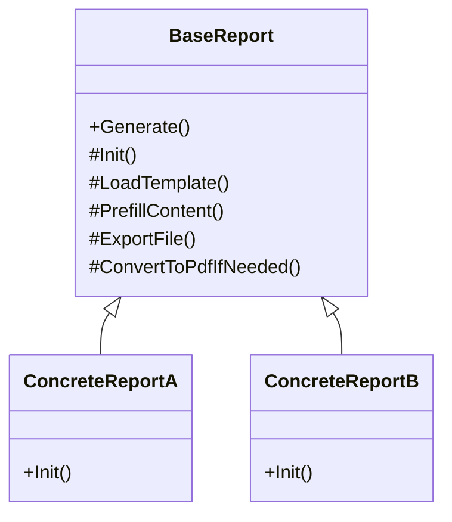

+++
date = '2026-01-19T10:13:24+08:00'
title = 'Template Method Pattern'
tags = ["Design Patterns"]
+++

在專案中有個需求要產生 100+ 份報表，格式包含Word與PDF，這些報表有幾個共同特性：

* 都需要從 Word 樣板產生
* 樣板中使用 unique token（例如 [XXX]）作為預填欄位
* 產出前需要先組合資料、預填內容
* 有些最後還要轉成 PDF

很直覺的作法是：每新增一個報表， 就寫一份產生報表邏輯

短期內可以快速交付功能， 但是造成的問題是：

* 每產生一個報表就會新增一套九成像的程式碼邏輯並散落在專案各處
* 想改一個共通行為要改很多地方
* 接手維護的工程師不知道哪個是標準寫法

真正的問題不是報表數量變多，而是同一個產生流程，被複製成太多版本

## Template Method Pattern

首先要釐清的兩件事情是：

* 哪些事情在報表中一定會做
* 哪些事情每份報表都不一樣

不會變的部分

* 讀取報表樣板
* 報表資料預填
* 輸出檔案
* 是否轉換成PDF檔案

會變的部分

* 報表的資料來源
* 預填欄位的內容與資料格式
* 輸出的檔案名稱

運用Template Method Patten的核心價值就在於：

* 把一定會做的流程固定下來
* 只把會變的部分交給子類別實作

避免每個報表**各自定義一套自己的產生流程**

## 實作 Template Method Patten

把報表產生流程抽象化，其實每份報表都在做同一件事：

1. 取得產生報表所需的資料
2. 讀取樣板文件， 填入預填資料
3. 輸出文件

在沒有Template Method Patten情況下， 每一份報表都要實作這三個流程

Template Method Patten作法是這樣的：

* Base class定義產生流程的順序
* 子類別負責準備這份報表所需資料

關鍵在於**子類別不能決定流程， 只能提供資料**

## 解決了甚麼問題

流程有了一致性

* 所有報表共用同一套產生流程
* 流程調整時只要修改`base class`

新增報表時變簡單

* 不用再思考怎麼產生這報表
* 只要關注報表需要甚麼資料

把會變、不會變的責任切乾淨

* 流程：集中在`base class`
* 資料：分散在子類別， 各自實現邏輯
* 提高可讀性與可維護性

Template Method Pattern在這裡解決的問題不是怎麼產生報表， 而是怎麼讓報表數量不斷成長時， 系統還能維持可預期的結構
